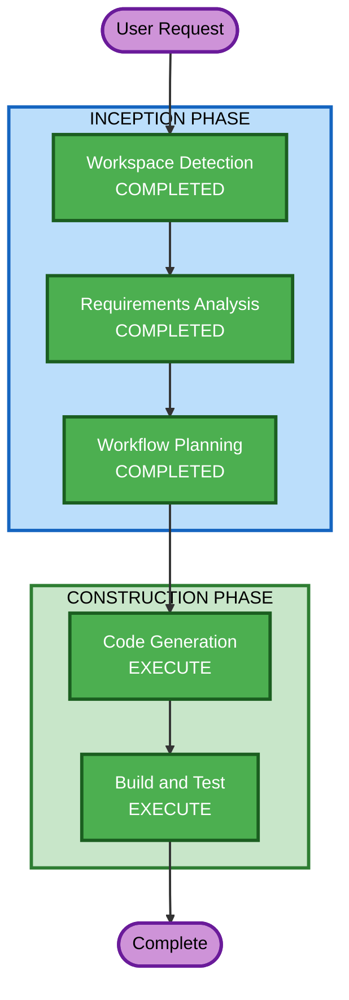

# Execution Plan

## Detailed Analysis Summary

### Change Impact Assessment
- **User-facing changes**: Yes — operators and developers will interact with Helm commands, k6 scripts, and Grafana dashboards
- **Structural changes**: Yes — new Helm umbrella chart with sub-chart dependencies, new repository structure
- **Data model changes**: No — no application data models; only Kubernetes resource definitions and k6 scripts
- **API changes**: No — no application APIs; the framework consumes existing service endpoints as test targets
- **NFR impact**: Yes — security hardening (SECURITY extension), property-based testing (PBT extension), multi-environment support

### Risk Assessment
- **Risk Level**: Medium — multiple interacting components (k6-operator, Grafana, Prometheus) but all are well-established Helm charts with known integration patterns
- **Rollback Complexity**: Easy — Helm rollback covers all components; no persistent state mutations
- **Testing Complexity**: Moderate — need to validate Helm template rendering, k6 script execution, Prometheus remote-write, and Grafana dashboard provisioning

## Workflow Visualization



### Text Alternative
```
Phase 1: INCEPTION
  - Workspace Detection (COMPLETED)
  - Requirements Analysis (COMPLETED)
  - User Stories (SKIPPED)
  - Workflow Planning (COMPLETED)
  - Application Design (SKIPPED)
  - Units Generation (SKIPPED)

Phase 2: CONSTRUCTION (single unit)
  - Functional Design (SKIPPED)
  - NFR Requirements (SKIPPED)
  - NFR Design (SKIPPED)
  - Infrastructure Design (SKIPPED)
  - Code Generation (EXECUTE) — includes inline security + PBT compliance
  - Build and Test (EXECUTE)
```

## Phases to Execute

### INCEPTION PHASE
- [x] Workspace Detection (COMPLETED)
- [x] Requirements Analysis (COMPLETED)
- [ ] User Stories - SKIP
  - **Rationale**: Infrastructure/platform project. Operators and developers are already well-characterized in requirements.
- [x] Workflow Planning (COMPLETED)
- [ ] Application Design - SKIP
  - **Rationale**: Components are already well-defined in requirements (k6-operator, Grafana, Prometheus, umbrella chart). No complex service layer or component method design needed. Architecture is sub-chart wiring.
- [ ] Units Generation - SKIP
  - **Rationale**: Single unit of work. File structure already agreed during requirements. No decomposition needed.

### CONSTRUCTION PHASE (single unit)
- [ ] Functional Design - SKIP
  - **Rationale**: No business logic to design. The "logic" is Helm template rendering and k6 script patterns, handled directly in code generation.
- [ ] NFR Requirements - SKIP
  - **Rationale**: Most SECURITY rules are N/A for a Helm chart project (no application auth, APIs, or databases). PBT applicability is limited. Security and PBT compliance will be assessed inline during Code Generation.
- [ ] NFR Design - SKIP
  - **Rationale**: Same as NFR Requirements — handled inline during Code Generation.
- [ ] Infrastructure Design - SKIP
  - **Rationale**: The entire project IS infrastructure. Helm charts and Kubernetes resources are the code. Designing them separately from generating them is redundant.
- [ ] Code Generation - EXECUTE (ALWAYS)
  - **Rationale**: All real work happens here — Helm charts, templates, k6 scripts, dashboards, values files, documentation. Security and PBT compliance checked inline.
- [ ] Build and Test - EXECUTE (ALWAYS)
  - **Rationale**: Helm template validation, k6 script syntax validation, dashboard JSON validation, PBT tests for any utility functions.

### OPERATIONS PHASE
- [ ] Operations - PLACEHOLDER

## Success Criteria
- **Primary Goal**: Deployable Helm-managed load-testing framework on EKS
- **Key Deliverables**: Umbrella Helm chart, k6 example scripts, Grafana dashboards, Prometheus integration, operational runbook
- **Quality Gates**: Applicable SECURITY rules compliant or N/A, applicable PBT rules compliant or N/A, Helm template renders cleanly, documentation complete
